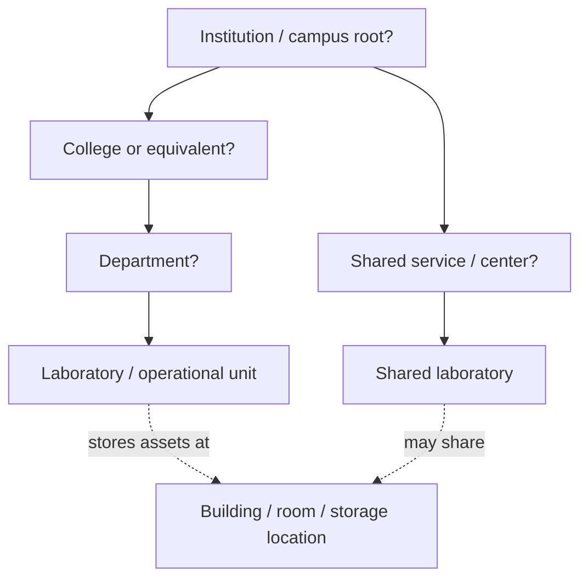

# 3. Organizational domain model

## Problem statement

V1 has globally shared collections and no ownership scope ([V1 scalability audit](../v1-audit/10-scalability-audit.md)). V2 requires organizational scoping, but the school's actual hierarchy and policy are unknown. The model must not hard-code Campus → College → Department → Laboratory until governance confirms those levels.

## Candidate models

| Model | Description | Strengths | Risks |
|---|---|---|---|
| Fixed hierarchy | Dedicated campus, college, department, lab tables with fixed parent rules | Easy terminology and reporting when structure is stable | Cannot represent skipped levels, centers, shared facilities, reorganizations cleanly |
| Generic organization tree | `organizations` with type and parent | Flexible depth; supports departments, labs, centers | Requires constraints/policy to avoid invalid trees; reporting must understand types |
| Flat operational units | Only labs/units with metadata | Simple initial delivery | Weak delegation, roll-up reporting, and policy inheritance |
| **Proposed: constrained organization tree + separate locations** | Generic tree with approved types/parent rules; physical locations independent | Separates governance from geography and supports variable structures | Requires stakeholder-approved allowed types and ancestry rules |

The proposed model is not accepted. It is the least-assumptive candidate pending V2-DEC-001.

Question marks indicate unresolved levels.

## Required conceptual distinctions

- **Owning organization:** accountable owner of an equipment pool/unit.
- **Administrative scope:** organization subtree over which a role applies.
- **Operating organization:** unit performing approval, checkout, or return.
- **Physical location:** campus/building/room/storage position; not automatically an owner.
- **Custodian:** person currently responsible for stewardship; not necessarily owner/admin.
- **Borrower's affiliations:** memberships used for eligibility, not ownership.

Example (illustrative, not school policy): Department A owns an asset, Laboratory B stores it, Custodian C manages it, and a borrower affiliated with Department D requests it under a cross-scope policy.

## Domain questions before selection

- Is there one campus, and must the model support multiple campuses later?
- Which levels legally/operationally own equipment?
- Can a lab belong directly to a college, institute, or central office?
- Are shared/core facilities outside departments?
- Can a user hold simultaneous memberships and manage non-ancestor scopes?
- Can an asset's owner differ from its operating unit and location?
- Can inventory move temporarily or permanently; who approves each?
- Which policies inherit down the tree, and can children override them?
- Which scopes require independent reporting, numbering, and retention?
- How should reorganizations preserve historical ownership names and ancestry?

The prioritized versions appear in [19-open-questions.md](19-open-questions.md).

## Organizational requirements

- Every governed resource must have an explicit owning scope or a documented institution-wide scope.
- Scope ancestry must be queryable and authorization-safe.
- Historical transactions/audit events must retain the organization context effective at the event time.
- Organizations and locations must support inactive/closed states rather than destructive deletion after use.
- Transfers must record source, destination, effective time, actor, and acceptance where required.
- Location changes must not silently change ownership or administrative responsibility.
- Policy resolution must be deterministic and auditable if inheritance is permitted.

## Policy scope candidates

Policies may apply to institution, organization subtree, operating unit, equipment type, asset, borrower affiliation, or combinations. Only requirements proven necessary should become configurable. MVP should prefer a small policy set (eligibility, approval, loan duration, pickup expiry, renewal, restriction) rather than a generic rules engine.

