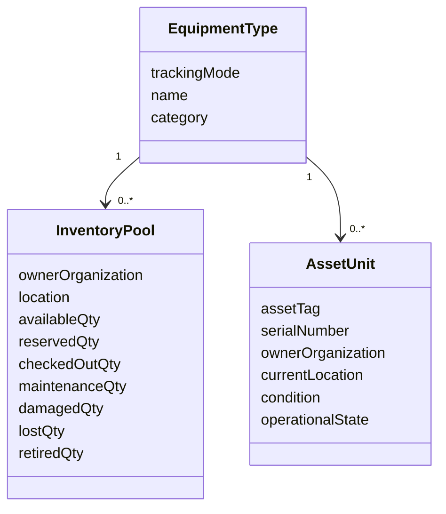

# 5. Equipment and asset domain

## Model options

| Option | Best for | Advantages | Limitations |
|---|---|---|---|
| Aggregate only | Interchangeable low-value bulk items | Simple counts and requests | Cannot identify a unit, serial, per-unit condition/history |
| Serialized only | High-value/calibrated traceable assets | Exact custody and lifecycle | Excessive data entry for cables, glassware, kits, consumables |
| **Hybrid (proposed)** | Mixed campus inventories | Tracks each type at the appropriate granularity | Requires explicit tracking mode and invariants |

V1 is aggregate-only and loses explicit damaged/lost buckets ([V1 equipment audit](../v1-audit/06-equipment-domain.md)). A hybrid model is proposed for stakeholder approval, not assumed accepted.

## Conceptual model

- **Equipment type:** catalog definition—name, category, manufacturer/model where relevant, description, default image, tracking mode, default policies.
- **Inventory pool:** quantity-managed holding of one equipment type at an owner/location, split into explicit state buckets.
- **Asset unit:** individually identified instance of an equipment type, normally with asset tag and optional serial number.
- **Category:** controlled discovery/reporting classification; hierarchy only if a real need exists.
- **Asset identifier:** asset tag, serial number, barcode/QR payload, and legacy V1 ID where applicable.
- **Custodianship:** responsibility assignment independent of owner and location.
- **Asset movement:** audited ownership/location/custodian change.
- **Attachment:** image/document metadata in object storage; never the binary inside relational rows.



A type uses aggregate pools, serialized units, or—in exceptional mixed holdings—both with clearly separated stock. A single physical unit must never appear in both representations.

## Field classification

| Concept | MVP | Optional when known | Future |
|---|---|---|---|
| Type | Name, description, tracking mode, category, active state | manufacturer, model, default image | specifications, compatibility |
| Unit identity | Asset tag, type, state, owner, location | serial number, acquisition reference, custodian, image | depreciation, warranty integration |
| Aggregate pool | Type, owner, location, explicit buckets | reorder threshold, custodian | procurement automation |
| Condition | Controlled condition and inspection note/date | condition grade/config by category | scored inspections |
| Lifecycle | Active/maintenance/damaged/lost/retired timestamps/reasons | disposal reference | approval workflow/proceeds |
| Classification | Category; restricted flag/policy link | tags | ontology/search enrichment |

Purchase price, acquisition date, supplier, calibration, and warranty are not universal MVP requirements; stakeholders must establish reporting/compliance needs before making them mandatory.

## Identity and uniqueness requirements

- Internal immutable UUID is the primary identity; user-facing identifiers are separate.
- Asset tag uniqueness scope (campus or organization) is a blocker decision.
- Serial number is optional but uniqueness must be enforceable when policy declares it authoritative.
- Legacy Firestore equipment ID and display name are retained as migration references, not new primary keys.
- Renaming a type must not alter historical loan-item snapshots.
- Duplicate detection must consider owner, type, serial, tag, and legacy mapping without silently merging.

## Ownership, location, and responsibility

Every pool/unit must have one accountable owning organization. Current physical location is independently recorded and can be temporary. A custodian is optional unless policy requires one, and must be time-bounded/history-aware. Transfers require reason, actor, source/destination, and effective time; ownership transfer may require a stronger approval than location movement.

## Inventory invariants

For aggregate pools:

```text
on_hand = available + reserved + checked_out + maintenance + damaged + other_hold
lost and retired are terminal/non-on-hand cumulative states unless policy defines recovery
all bucket quantities are integers >= 0
```

The exact bucket equation and whether damaged items remain on hand require policy confirmation, but every physical disposition must be represented once. For serialized units, one unit has exactly one current operational/custody state and at most one open reservation/loan allocation.

## Search/discovery requirements

Server queries must scope by borrower eligibility and organization, then support text, category, owner, location, tracking mode, restriction, operational state, and availability filters; stable sorting and cursor/keyset pagination are required. Results must not reveal restricted asset details to ineligible users. Counts should be derived from authoritative buckets/allocations, not browser-downloaded collections.

## Deletion and retention

Used equipment/type records are deactivated or retired, not hard-deleted. Hard deletion is limited to authorized correction of never-used records and is audited. Historical names, ownership context, tags, and values needed for loan/audit evidence remain available under retention rules.

