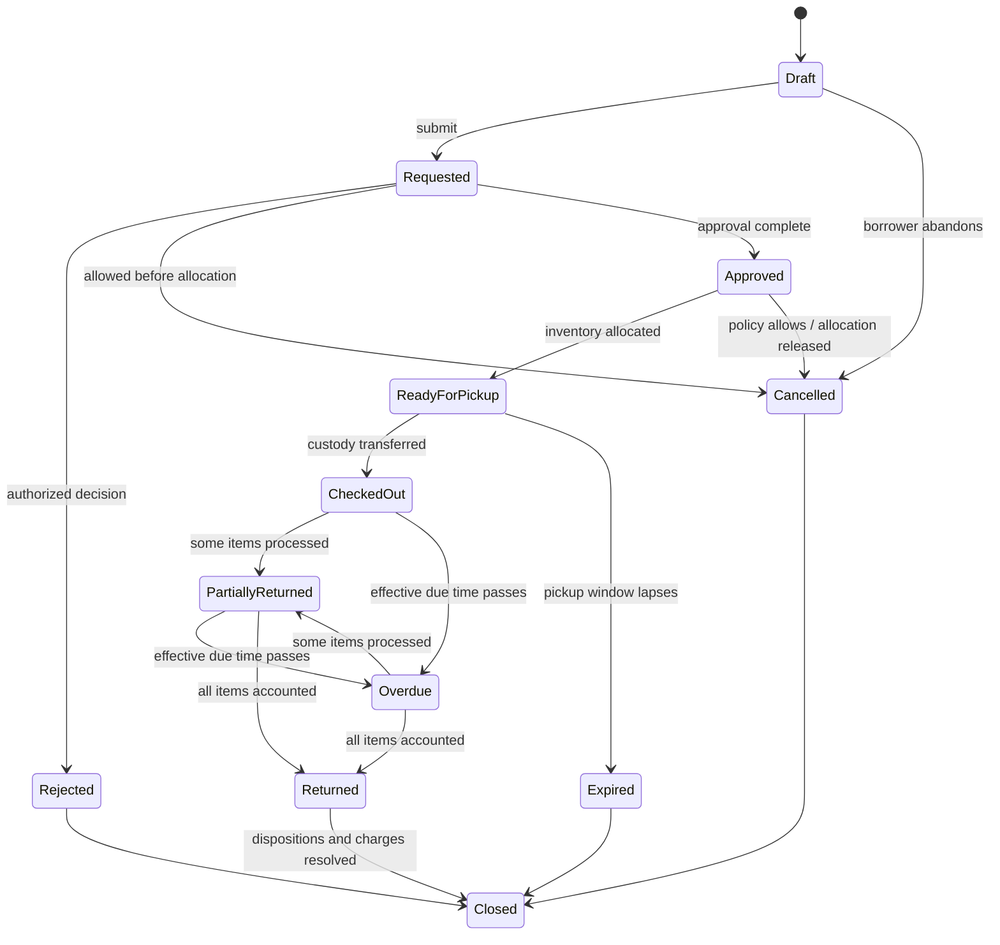

# 6. Borrowing domain

## Domain separation

V1 overloads a single transaction as request, reservation, loan, return, and history ([V1 workflow](../v1-audit/07-borrowing-workflow.md)). V2 proposes distinct concepts:

- **Borrow request:** borrower's requested items, dates, purpose, and decision lifecycle.
- **Approval decision:** actor, item-level decision, conditions, reason, time.
- **Reservation/allocation:** time-bounded claim on aggregate quantity or asset unit.
- **Loan/checkout:** actual custody transfer, due date, releasing staff, borrower.
- **Loan item:** exact pool quantity or serialized unit checked out, with condition snapshot.
- **Return:** processing event for one or more loan items.
- **Return item/disposition:** returned-good, damaged, lost, missing/pending, with quantities/condition.
- **Extension:** requested/approved due-date change retaining history.
- **Cancellation/rejection:** terminal request outcomes retained with reason/audit.

## Proposed lifecycle

Justification: `Draft` supports safe editing; `Requested`, `Approved`, and `Rejected` preserve decisions; `ReadyForPickup` distinguishes allocation from custody; `CheckedOut` is the actual loan; partial/overdue states support V1 parity; `Returned` separates physical accountability from administrative `Closed`. Whether Approved and ReadyForPickup can collapse for some labs is unresolved.

Overdue should generally be derived from an open loan and effective due time, with a recorded overdue event for audit/notifications—not a status that erases the underlying custody state.

## Core rules and commands

| Command | Required checks | Atomic effects |
|---|---|---|
| Submit request | authenticated eligible borrower; items/dates/purpose valid | request/version/audit |
| Decide request | scoped approver; request pending; separation rules | decision, request state, optional allocation, audit, outbox |
| Allocate | availability; policy; allocation not duplicated | reserve pool quantity/unit, expiry, audit |
| Checkout | allocation valid; borrower identity; item condition | create loan/items, reserved→checked-out or unit state, audit, outbox |
| Cancel/expire | allowed state/actor; no custody transfer | release allocation, retain terminal request, audit |
| Request/approve extension | open loan; policy; no conflicts | new effective due date plus immutable extension decision |
| Process return | scoped operator; open balance; disposition valid | return event/items, inventory/unit states, loan balance, charge assessment trigger, audit |
| Close | all items accounted; required reviews complete | terminal closure/audit |

## Inventory consistency requirements

- PostgreSQL transactions must atomically lock/check affected pool rows or allocations and update counts; the strategy must be proven with concurrency tests.
- Availability cannot become negative and one serialized unit cannot have overlapping active allocation/custody.
- Request approval must define whether it reserves stock. A request without allocation must not advertise guaranteed availability.
- Checkout and reserved-to-checked-out transfer are one transaction.
- Returns and corresponding inventory/disposition changes are one transaction.
- Client retries use idempotency keys for submission, decisions, checkout, returns, and payments/adjustments.
- Commands use expected version/state to reject stale transitions; duplicate requests return the original result rather than replaying effects.
- Database constraints protect integers, uniqueness, references, and permitted ownership even when application code fails.
- A reconciliation process compares pool buckets/units with open allocations and loans, records discrepancies, and never silently rewrites history.

## Cross-department borrowing decision framework

| Policy option | Eligibility | Approval | Visibility | Tradeoff |
|---|---|---|---|---|
| Same laboratory only | Membership in operating lab | Local | Local | Simple, not campus-sharing |
| Same department | Department membership | Owning lab or department | Department scoped | Enables local sharing |
| Cross-department opt-in | Any eligible borrower where owner policy permits | Owner approval; optional home endorsement | Need-to-know across scopes | Balanced sharing/governance |
| Cross-college escalation | Explicitly eligible resources/borrowers | Owner plus designated higher approval | Limited cross-scope | More control, more delay |
| Institution-wide catalog | Broad discovery; restriction per asset/type | Risk-based | Search may hide sensitive detail | Maximum reuse, complex policy |

Restricted equipment may require training/certification, faculty sponsorship, purpose, higher approval, shorter duration, or no off-site use. These are policy options, not requirements until confirmed.

## Borrowing policy requirements

Policies must have scope, version, effective dates, priority/inheritance rules, and audit history. Candidate MVP inputs are eligibility, maximum duration, request lead time, pickup expiry, renewal allowance, concurrent-loan limit, restricted-equipment rule, and approval path. Avoid a general rules engine until actual policy variation is known.

## Exceptional flows requiring decisions

No-show pickup, unavailable-after-approval, substitute asset, wrong item, return at another lab, disputed damage, recovered lost asset, borrower suspension with open loan, owner transfer during loan, and emergency administrative correction all require explicit actor/state/audit rules before implementation.

