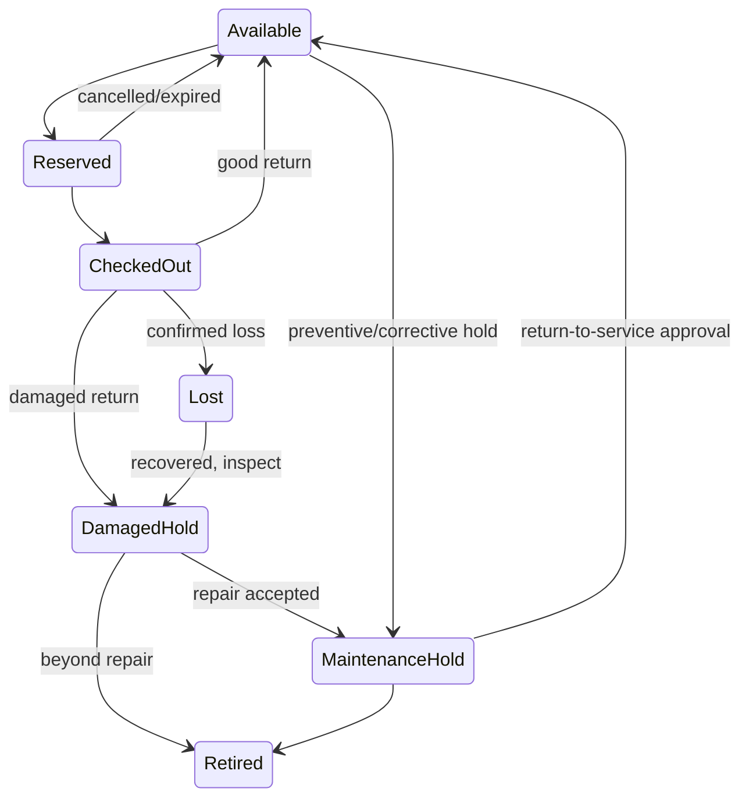

# 7. Maintenance and asset lifecycle

## Purpose

V1 has condition/status labels but no maintenance record. V2 must at minimum prevent damaged or maintenance-held inventory from appearing available and preserve the reason/history of state changes.

## State concepts

For serialized units, operational state and custody/allocation should be modeled explicitly. A practical candidate vocabulary is:

- `available`
- `reserved`
- `checked_out`
- `maintenance_hold`
- `damaged_hold`
- `lost`
- `retired`

For aggregate pools, equivalent quantities live in buckets. “Damaged” should not automatically mean repairable or retired; inspection determines disposition. A recovered lost unit requires an audited transition, not recreation.

## Proposed MVP maintenance capability

- Open a maintenance/inspection record against a unit or pool quantity.
- Record source (return inspection, staff observation, scheduled need), issue, reporter, priority, affected quantity/unit, timestamps, and attachments.
- Move affected inventory atomically to a nonavailable bucket/state.
- Assign responsible person/team optionally.
- Record work notes and outcome: return to service, remain on hold, retire, or adjust affected quantity.
- Require scoped authorization for return-to-service and retirement.
- Preserve condition snapshots at checkout and return.
- Audit all lifecycle changes.

## Future maintenance capability

Preventive schedules, calibration certificates/due dates, service-provider management, parts and cost records, downtime analytics, warranties, approvals, and integrations are future unless compliance stakeholders make them MVP requirements.

## Lifecycle requirements

- Condition and operational state are distinct: condition describes observed quality; state determines usability/allocation.
- Damage/loss reported during return creates explicit disposition and may open maintenance/charge review without blocking unrelated returned-good quantity.
- Retirement/disposal is terminal unless an exceptional audited correction is authorized.
- Historical loans and audit events retain the unit/type/owner context after retirement.
- Ownership/location transfers must be blocked or specially handled while a unit is checked out or under maintenance.
- Maintenance records must not expose sensitive notes to borrowers unless intended.
- Aggregate adjustments require reason codes and before/after quantities; negative “correction” without evidence is prohibited.

## Unresolved policy

Who may diagnose, return to service, retire, transfer, or declare lost; whether calibration is legally/academically required; whether maintenance cost is tracked; and whether external providers need access are stakeholder decisions.

