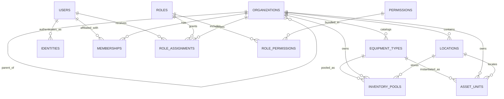
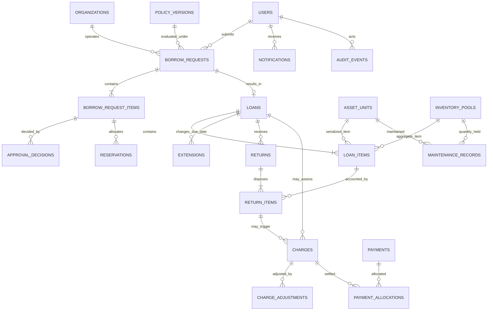

# 13. Conceptual PostgreSQL-oriented data model

## Status

This is a domain model for discussion, not a migration or final physical schema. Names, decomposition, status vocabularies, and optional entities remain subject to Phase 2 and decisions in [18-decision-register.md](18-decision-register.md).

## Identity, organization, inventory

## Borrowing, accountability, operations

## Entity catalog

| Entity | Purpose and important lifecycle fields |
|---|---|
| `organizations` | Typed, parented governance units; active/inactive; stable ID and historical name handling |
| `locations` | Campus/building/room/storage hierarchy or structured address; active state; separate from ownership |
| `users` | Internal person identity, status and profile; no password fields when external IdP used |
| `identities` | Provider + immutable subject, verified email/claims snapshot, link status; unique provider/subject |
| `memberships` | User affiliation to organization, type, validity and source |
| `roles`, `permissions`, `role_permissions` | Governed capability bundles |
| `role_assignments` | User/role/scope/effective dates/grant metadata; optional child-scope flag |
| `equipment_types` | Catalog definition and tracking mode; owner/catalog scope and active state |
| `inventory_pools` | Aggregate holding by type/owner/location with explicit quantity buckets and version |
| `asset_units` | Serialized asset tag/serial, type, owner, location, condition, state and version |
| `borrow_requests`, `borrow_request_items` | Requested purpose/dates/scope and item/quantity/unit preferences; state/version |
| `approval_decisions` | Append-oriented item/request decision, actor, reason, conditions, time |
| `reservations` | Time-bounded pool quantity or unit allocation; status/expiry/idempotency |
| `loans`, `loan_items` | Custody header and exact checked-out quantities/units with due dates and condition snapshots |
| `extensions` | Requested/decided due-date changes and history |
| `returns`, `return_items` | Processing event and per-item good/damaged/lost/pending dispositions |
| `maintenance_records` | Issue/work/outcome for unit or pool quantity; open/closed lifecycle |
| `charge_policies`, `policy_versions` | Scoped, effective and immutable versions of approved rules |
| `charges`, `charge_adjustments` | Authoritative assessments and append-only corrections/waivers |
| `payments`, `payment_allocations` | Only if authorized payment evidence is in scope |
| `notifications`, `notification_deliveries` | In-app event and per-channel delivery attempts/status |
| `audit_events` | Immutable actor/action/entity/scope/correlation and safe payload |
| `attachments` | Private object metadata and entity link; storage key, type, size, checksum |
| `legacy_mappings` | Source system/collection/document ID to V2 entity, migration run and confidence |

## Likely identity and uniqueness constraints

- UUID primary keys; mutable display codes are not PKs.
- Unique `(identity_provider, provider_subject)`.
- Organization code unique within parent or institution, decision pending.
- Location code unique within parent/scope.
- Asset tag unique campus-wide or within owner scope (blocker decision).
- Optional serial uniqueness by manufacturer/model or institution only if reliable.
- One active serialized reservation/loan custody allocation per asset unit, protected by constraints/transaction logic.
- Non-negative integer pool buckets and one pool per `(equipment_type, owner_org, location, configured variant)`.
- Display request/loan codes unique in their defined scope; legacy IDs need not be made globally unique.
- Idempotency key unique per actor/client + command family/route within retention window.
- At most one active role assignment for the same subject/role/scope/time interval where overlap is invalid.
- Unique source event for idempotent charge and notification generation.

## Status and history principles

Use controlled statuses with transition validation, but do not encode every time-derived fact as a mutable status. Overdue is derivable from open balance and due time while an event/notification history records its occurrence. Decisions, extensions, returns, adjustments, payments, and audit events are append-oriented. Aggregate/root records may expose current state/version for efficient queries.

## Soft deletion

Organizations, locations, types, units, users and policies referenced by history normally become inactive/retired, not deleted. Requests, loans, returns, charges, payments and audit events are retained per policy. Hard deletion is limited to unused erroneous records or privacy processes with explicit authorization and audit. The schema must distinguish business deactivation, retention expiry, and anonymization.

## Normalization tradeoffs

Operational facts should be relational and constrained. Historical snapshots of display name, asset tag, condition, organization label, and policy calculation inputs may be intentionally stored on immutable items/events so later master-data changes do not rewrite evidence. Reporting projections/materialized views may denormalize read models; they are not authorities.

