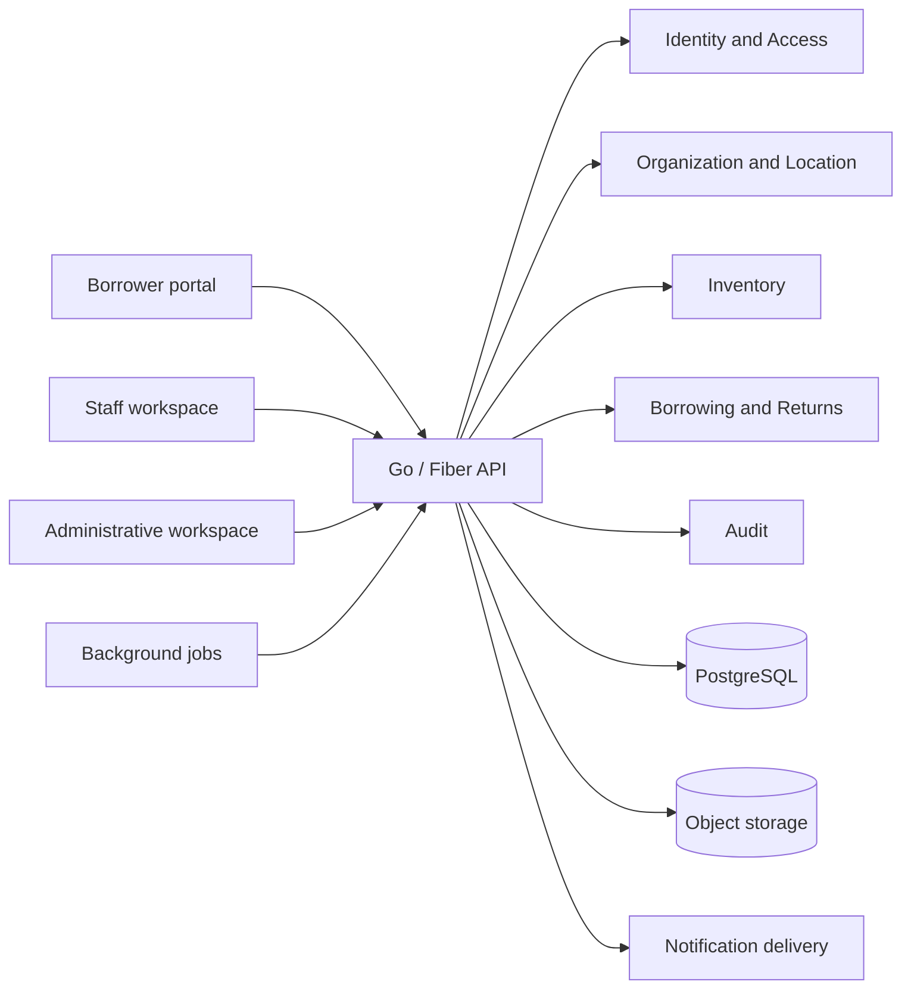

# eLabTrack V2 requirements and domain-design package

**Phase:** 1 — requirements and domain design  
**Date:** 2026-10-04  
**Status:** Draft for stakeholder review; no V2 implementation has begun

## Purpose and authority

This package defines a decision-ready product and domain baseline for a campus-scale successor to eLabTrack V1. It uses the complete [V1 audit](../v1-audit/README.md) as legacy evidence while deliberately avoiding V1's client-trusted, globally scoped architecture.

Terminology used throughout:

- **V1 fact:** behavior or data evidenced by the repository audit.
- **Requirement:** a condition V2 must satisfy to be safe or fit for purpose.
- **Proposal:** a candidate design pending approval.
- **Unresolved policy:** a school decision the repository cannot establish.
- **Future:** deliberately outside the proposed MVP.

No document here is an implementation specification, database migration, OpenAPI contract, or approval to change V1.

## Index

| Document | Subject |
|---|---|
| [01-product-vision-and-scope.md](01-product-vision-and-scope.md) | Vision, MVP, exclusions, portfolio positioning |
| [02-stakeholders-and-user-types.md](02-stakeholders-and-user-types.md) | Stakeholders, personas, capability needs |
| [03-organizational-domain-model.md](03-organizational-domain-model.md) | Candidate hierarchy, ownership, locations, policy scope |
| [04-role-and-permission-model.md](04-role-and-permission-model.md) | Scoped RBAC, capabilities, candidate roles |
| [05-equipment-and-asset-domain.md](05-equipment-and-asset-domain.md) | Hybrid inventory and asset lifecycle concepts |
| [06-borrowing-domain.md](06-borrowing-domain.md) | Requests, approvals, reservations, loans, returns, invariants |
| [07-maintenance-and-asset-lifecycle.md](07-maintenance-and-asset-lifecycle.md) | Damage, loss, maintenance, calibration, retirement |
| [08-fines-payments-and-accountability.md](08-fines-payments-and-accountability.md) | Authoritative charge/payment concepts |
| [09-notifications-and-communications.md](09-notifications-and-communications.md) | Events, channels, delivery lifecycle, preferences |
| [10-reporting-and-audit.md](10-reporting-and-audit.md) | Operational, historical and audit reporting; search |
| [11-non-functional-requirements.md](11-non-functional-requirements.md) | Performance, availability, accessibility, mobile, operations |
| [12-security-requirements.md](12-security-requirements.md) | Authentication discovery and security requirements |
| [13-conceptual-data-model.md](13-conceptual-data-model.md) | PostgreSQL-oriented conceptual relational model |
| [14-api-and-system-boundaries.md](14-api-and-system-boundaries.md) | Backend contexts, API principles, frontend surfaces |
| [15-v1-to-v2-migration-strategy.md](15-v1-to-v2-migration-strategy.md) | Discovery, mapping, validation, cutover and rollback |
| [16-testing-and-quality-strategy.md](16-testing-and-quality-strategy.md) | Test layers, quality gates, observability |
| [17-rollout-and-campus-adoption.md](17-rollout-and-campus-adoption.md) | Pilot, training, coexistence, cutover options |
| [18-decision-register.md](18-decision-register.md) | 16 numbered decisions requiring governance |
| [19-open-questions.md](19-open-questions.md) | 52-question prioritized stakeholder questionnaire |
| [20-v2-roadmap.md](20-v2-roadmap.md) | Staged roadmap after approval |

## Proposed direction in one view

The preferred eventual implementation stack is React + TypeScript + Vite, Go + Fiber, PostgreSQL, Docker, and Linux. Phase 1 accepts that direction as a constraint for design evaluation, not permission to scaffold it. Authentication remains undecided pending institutional identity discovery.

## Proposed MVP boundary

The MVP preserves essential V1 capability while adding the controls required for safe multi-organization operation:

- authenticated borrower and staff access;
- organization/location scoping and delegated administration;
- hybrid aggregate/serialized inventory with explicit ownership and location;
- request, approval/rejection/cancellation, reservation, checkout, partial return, overdue, final return, and closure;
- atomic inventory operations, idempotent commands, reconciliation;
- condition/damage/loss capture and a minimal maintenance hold/ticket;
- authoritative audit trail;
- in-app notifications plus one institution-approved external channel;
- server-side search, filtering, sorting, pagination, and scoped operational reports;
- migration of validated V1 users, equipment, active loans, history, images, and legacy identifiers.

Fine policy, SSO choice, cross-department rules, payment integration, native mobile, advanced preventive maintenance, and campus analytics remain decisions or later capability unless stakeholders establish them as launch blockers.

## Approval gates

Phase 2 architecture/database design should not start until the blocker questions in [19-open-questions.md](19-open-questions.md) and the corresponding “Needs stakeholder input” decisions are resolved. V1 emergency containment in [12-security-requirements.md](12-security-requirements.md) is an independent urgent track and must not wait for V2.

## Package validation

- All 21 expected Markdown files exist and are nonempty.
- All internal Markdown targets resolve.
- Seven Mermaid blocks have balanced fences and were inspected for reasonable syntax.
- The register contains 16 unique, sequential decision IDs; none is marked Accepted.
- The questionnaire contains 52 unique, sequential question IDs across all requested groups.
- Exact known-key and general credential-pattern scans found no credential value in this package.
- Git status shows only the new `docs/v2-design/` directory; no application source was changed.
